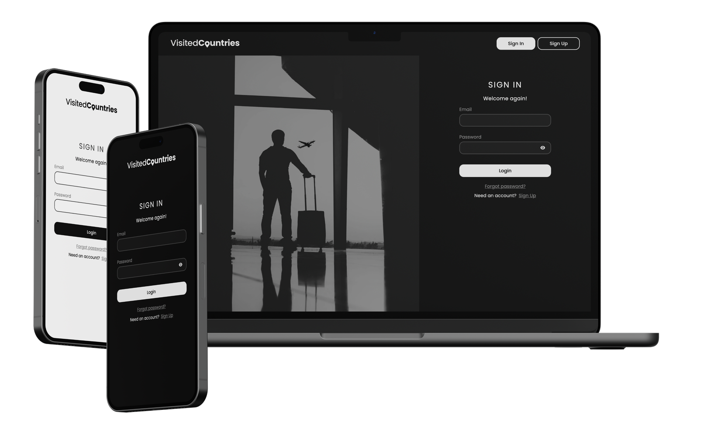

<div align='center'>

# 


##

TECH<strong>STACK</strong>


##

APP<strong>DEMO</strong>

<a href="https://visited-countries.vercel.app/" style='color: red;'>`https://visited-countries.vercel.app`</a>



<br />
<br />

##

APP<strong>CONFIG</strong>

<div align='left'>

> <i>1. Clone this repository and install dependencies</i>
>
> `git clone https://github.com/jaroslaw91/visited-countries.git`
>
> `cd visited-countries`
>
> `pnpm install`

</div>

<div align='left'>

> <i>2. Configure your firebase (https://cloud.google.com/firestore/docs/client/get-firebase)</i>
>
> - Add <b>Authentication</b> and Sign-in method with <b>Email/Password</b>
>
> - Create <b>Realtime Database</b> and add rules:
>
>   > ```
>   > {
>   >  "rules": {
>   >    ".read": false,
>   >    ".write": false,
>   >    "users": {
>   >      "$user_id": {
>   >         ".read": "$user_id === auth.uid",
>   >        	".write": "$user_id === auth.uid"
>   >      }
>   >    }
>   >  }
>   > }
>   > ```
>
> - Create <b>Storage</b> and create <b>images/</b> catalog

</div>

<div align='left'>

> <i>3. Add envs to the project (Sentry & Firebase)</i>
>
> > ```
> > VITE_SENTRY_DNS=
> > VITE_SENTRY_ALLOW_URL=
> >
> > VITE_FIREBASE_API_KEY=
> > VITE_FIREBASE_AUTH_DOMAIN=
> > VITE_FIREBASE_DATABASE_URL=
> > VITE_FIREBASE_PROJECT_ID=
> > VITE_FIREBASE_STORAGE_BUCKET=
> > VITE_FIREBASE_MESSAGING_SENDER_ID=
> > VITE_FIREBASE_APP_ID=
> > VITE_FIREBASE_MEASUREMENT_ID=
> > ```

</div>

<div align='left'>

> <i>4. Fire up the app with `pnpm dev` and... Enjoy!</i>

</div>


<br />
<br />

##

TODO<strong>LIST</strong>

- [x] removing a country from the list of countries
- [x] adding a country to the list of countries
- [ ] complete the tests
- [ ] adding country with Select
- [ ] code optimization
- [ ] add delete confirmation modal
- [ ] add country information
- [ ] add profile update
- [ ] add a Help tab

</div>
